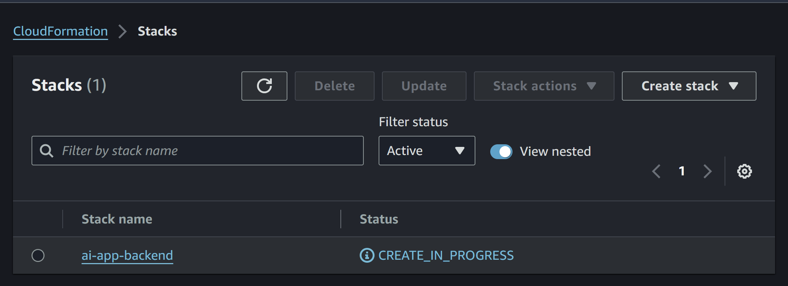

# Backend for Pirate GPT Project

This directory contains the back end for the **Pirate GPT Chatbot Project** at [traintocode.com/projects/pirate-gpt](https://traintocode.com/projects/pirate-gpt/).  The back end consists of one [AWS Lambda](https://aws.amazon.com/lambda/) function written in Typescript and called with an HTTP request to the [function URL](https://docs.aws.amazon.com/lambda/latest/dg/lambda-urls.html).  [Serverless Framework](https://www.serverless.com/) is used to simplify the deployment process.

## Prerequisites

### 1 - Create AWS & OpenAI Accounts

* You will need an account with OpenAI to call the ChatGPT API.  [Sign up here](https://platform.openai.com/signup) and follow [this guide to get an API key](https://platform.openai.com/docs/quickstart/account-setup).  **Do not share your OpenAI API key** or commit it to version control.

* You will also need an [AWS account](https://aws.amazon.com/resources/create-account/).  After creating your account, follow [this guide to create an save local credentials](https://docs.aws.amazon.com/cli/latest/userguide/cli-chap-welcome.html).  You will need credentials set up on your local machine with permission to push resources to S3 and AWS Lambda.

### 2 - Create Deployment Bucket

Once you have completed the above two steps, [create a new S3 bucket](https://docs.aws.amazon.com/AmazonS3/latest/userguide/create-bucket-overview.html) to store the files for your deployments.

### 3 - Create .env File

Create a new file in this directory called `.env` and copy your OpenAI API key and deployment bucket name into two environment variables like this:

```sh
OPENAI_KEY=<<your-api-key>>
DEPLOY_BUCKET=<<your-deployment-bucket-name>>
```

The `.env` file will be ignored by Git to ensure you don't check in these two values to source control.

## Deployment

1. Install [Serverless Framework](https://www.serverless.com/) globally: 
```sh
npm install -g serverless
```

2. Install local npm packages
```sh
npm install
```

3. Deploy the backend to your AWS account
```sh
sls deploy --stage prod
```

4. Note down the **endpoint** url that is created for the new AWS Lambda function, the endpoint url will look like this `https://xxxxxxxxxxxxxxxxx.lambda-url.eu-west-3.on.aws`.

```sh
$ sls deploy --stage prod
Running "serverless" from node_modules

Deploying ai-app-backend to stage prod (eu-west-3)
Compiling with Typescript...
Using local tsconfig.json - tsconfig.json
Typescript compiled.

✔ Service deployed to stack ai-app-backend (117s)

endpoint: https://xxxxxxxxxxxxxxxxx.lambda-url.eu-west-3.on.aws/
functions:
  callchatgpt: ai-app-backend-prod-callchatgpt (23 MB)
```

Above is an example console output from running the `sls deploy --stage prod` command in step 3, with the endoint url of the created AWS Lambda function.

## Deleting Your Resources

You can check the status of your deployment, or delete everything created by navigating to [CloudFormation in the AWS Console](https://eu-west-3.console.aws.amazon.com/cloudformation/home) and looking for the stack named `ai-app-backend`




## Debugging Locally

There is a local entry point [./debug.ts](./debug.ts) that you can run with a NodeJS debugger such as [that included in Visual Studio Code](https://code.visualstudio.com/docs/typescript/typescript-debugging).  Simply run `npm install`, open in VSCode and hit **F5** (or select _Run -> Start Debugging_).


## Connecting The Front End

After followin the steps above to deploy your AWS Lambda function, add the `endpoint` url into the front end by copying the URL to your [App.tsx component](../frontend/src/App.tsx#L24)

```
    // NOTE: replace this url with the url of your lambda function once deployed:
    const response = await fetch('https://xxxxxxxx.lambda-url.eu-west-2.on.aws/', {
      method: 'POST',
      body: JSON.stringify({ messages: newMessages })
    });
```
